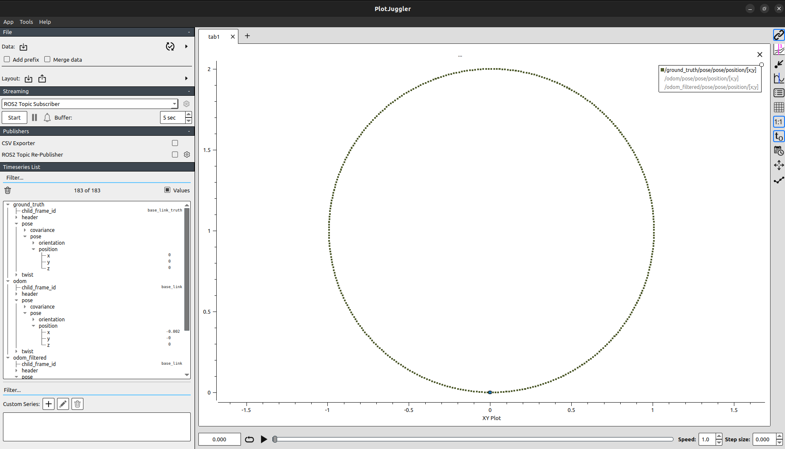
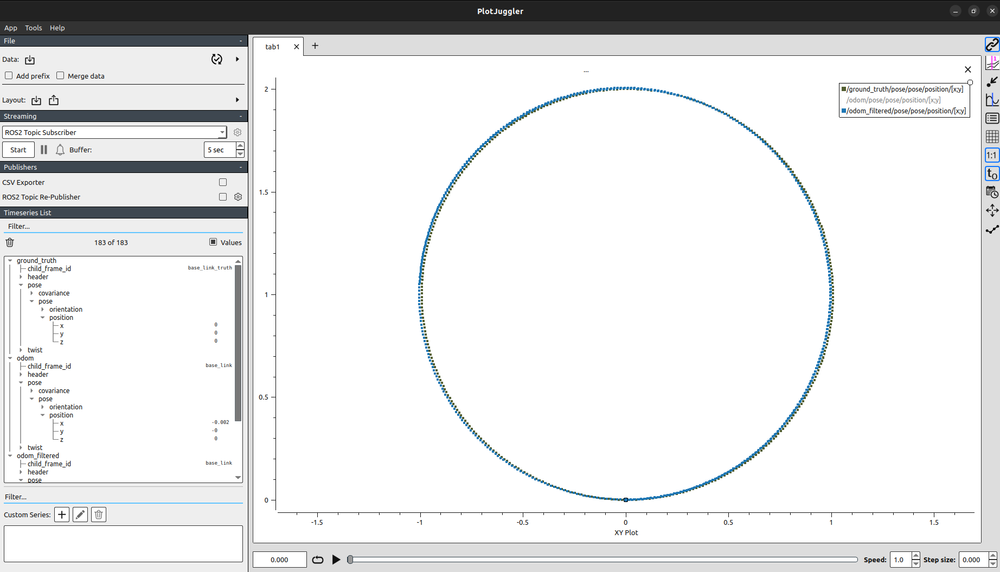

# Custom Odometry & Sensor Fusion Stack (ROS 2 Humble)

## Overview
This project is a robotics software pipeline built from scratch in ROS 2 Humble. It creates a lightweight simulation of a differential drive robot to demonstrate the challenges of real-world navigation.

The core objective is to simulate Sensor Noise and build a custom Sensor Fusion Engine to solve the problem of "Integration Drift" without relying on heavy external simulators like Gazebo.

### Project Evolution
* **Level 1 (The Problem):** Implemented Dead Reckoning using wheel encoders. Visualized how small sensor errors accumulate over time, causing the robot to "get lost."
* **Level 2 (The Solution):** Built a custom Sensor Fusion Node (Complementary Filter) that fuses noisy wheel data with a simulated IMU to correct the drift.

## Features

### 1. Custom Physics Engine (No Gazebo Required)
A lightweight Python node (`physics_node`) that acts as the "Real World" simulation:
* **Kinematics:** Simulates realistic differential drive movement.
* **Encoders:** Adds Gaussian Noise ($\mu=0, \sigma=0.05$) to wheel ticks to mimic real-world hardware imperfections.
* **IMU:** Simulates a gyroscope with rotational noise to provide imperfect heading data.

### 2. Odometry System (Level 1)
* **Method:** Calculates position using raw encoder data and Euler Integration.
* **Purpose:** Demonstrates severe **Integration Drift**, visualizing how small errors accumulate over time causing the position estimate to slowly diverge from reality.

### 3. Sensor Fusion Engine (Level 2)
* **Method:** Implements a custom **Complementary Filter** from scratch.
* **Data Fusion:** Combines the stable *Linear Velocity* from the wheels with the accurate *Angular Velocity* from the IMU.
* **Result:** Effectively eliminates rotational drift, keeping the robot's heading locked to the Ground Truth even during long operations.

### 4. Autonomous Controller
* **Algorithm:** A Proportional (P) Controller capable of autonomous navigation.
* **Logic:** Uses a "Turn-then-Move" strategy for precise movement to specific target coordinates ($x, y$).

## Results
I validated the performance of the Level 2 Fusion Node using PlotJuggler to compare the estimated paths against the Ground Truth.
* **Ground_truth:** The actual physical path (Perfect circle). 

* **Raw_Odometry:**  Drifts significantly over time due to accumulated error.

* **Sensor Fusion:** The filtered estimate. It tracks the Ground Truth almost perfectly by correcting heading errors using the IMU.

##  Tech Stack
* **Framework:** ROS 2 Humble
* **Language:** Python 3.10
* **Visualization:** Rviz2, PlotJuggler
* **Libraries:** `rclpy`, `tf2_ros`, `geometry_msgs`, `nav_msgs`, `sensor_msgs`
